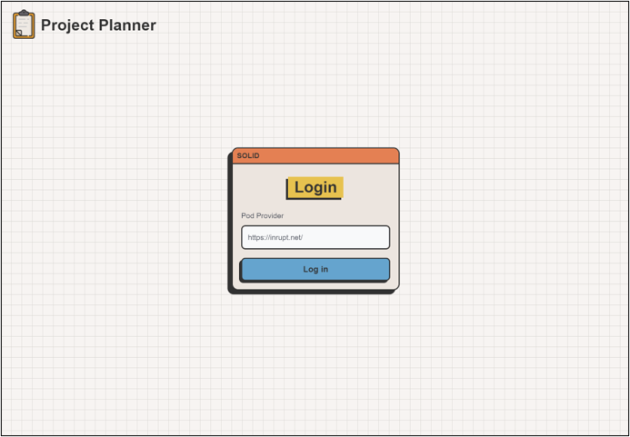
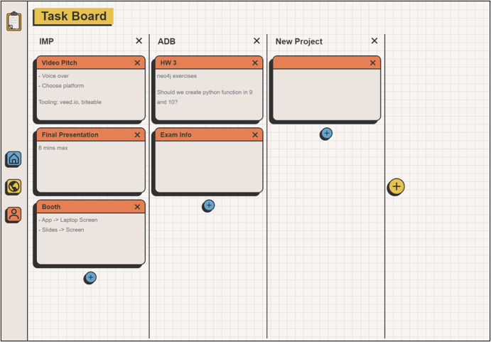
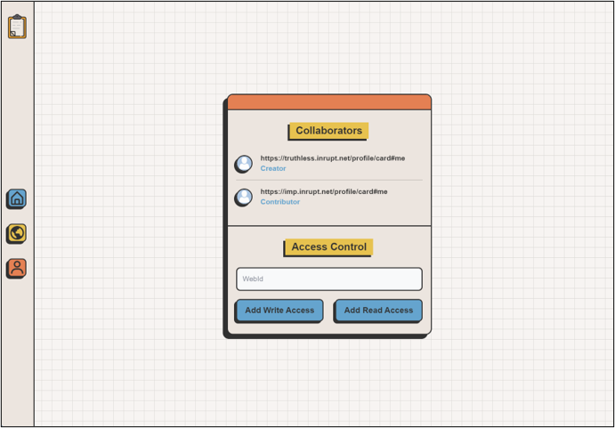
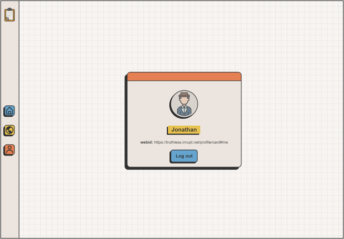

# Sample Web Application with y-solid Provider

This repository contains a sample web application that demonstrates the usage of the "y-solid" provider, which is an extension to Yjs. The "y-solid" provider adds access control, decentralized backup data storage in a private data pod, and provides discoverability and availability for collaborative data.

The web application in this repository is a collaborative task board app with solid authentication, user management, and access control. It is implemented using React as a Progressive Web Application (PWA), making it fully functional as a local-first application.

## Features

- Collaborative task board: Multiple users can collaborate on a shared task board, creating, editing, and managing tasks in real-time.
- Solid authentication: Users can log in using their Solid identity and access their personalized task boards.
- User management: Administrators can manage user accounts and permissions, allowing fine-grained control over who can access and modify the task boards.
- Access control: The "y-solid" provider integrates access control mechanisms, ensuring that only authorized users can access and modify the collaborative data.
- Decentralized backup data storage: Collaborative data is stored in a private data pod, ensuring data resilience and availability even if the primary server goes down.

## Screenshots

|    |  |
| --------------------------------- | ----------------------------------------- |
| Login                             | Task Board                                |
|  |        |
| Access Control                    | Profile                                   |

## Installation

1. Clone this repository to your local machine.
2. Install the required dependencies using your preferred package manager. For example, if you're using npm, run the following command:
   ```
   npm install
   ```
3. Build the application using the following command:
   ```
   npm run build
   ```
4. Start the application using the following command:
   ```
   npm start
   ```
5. Open your web browser and visit `http://localhost:3000` to access the application.
